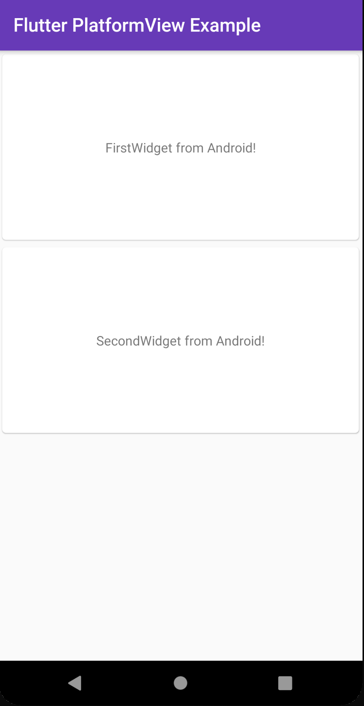

# Flutter PlatformView Example

This repository is published to explain about a Flutter PlatformView.

```bash
flutter run
```



On this example, two widgets were implemented as an Android Native-UI using Kotlin.

- [HomeScreen (home.dart)](./lib/home.dart)

```dart
import 'package:flutter/material.dart';
import './first.dart';
import './second.dart';

class HomeScreen extends StatelessWidget {
  const HomeScreen({Key key}) : super(key: key);

  @override
  Widget build(BuildContext context) {
    return Scaffold(
      appBar: AppBar(
        title: const Text('Flutter PlatformView Example'),
      ),
      body: Column(
        mainAxisSize: MainAxisSize.min,
        mainAxisAlignment: MainAxisAlignment.spaceAround,
        children: const <Widget>[
          Card(
            child: SizedBox(
              height: 200,
              child: FirstWidget(),
            ),
          ),
          Card(
            child: SizedBox(
              height: 200,
              child: SecondWidget(),
            ),
          ),
        ],
      ),
    );
  }
}
```

- [FirstWidget (first.dart)](./lib/first.dart)

```dart
import 'dart:async';
import 'package:flutter/foundation.dart';
import 'package:flutter/material.dart';
import 'package:flutter/services.dart';

typedef FirstWidgetCreatedCallback = void Function(
    FirstWidgetController controller);

class FirstWidget extends StatefulWidget {
  const FirstWidget({
    Key key,
    this.onFirstWidgetWidgetCreated,
  }) : super(key: key);

  final FirstWidgetCreatedCallback onFirstWidgetWidgetCreated;

  @override
  State<StatefulWidget> createState() => _FirstWidgetState();
}

class _FirstWidgetState extends State<FirstWidget> {
  @override
  Widget build(BuildContext context) {
    if (defaultTargetPlatform == TargetPlatform.android) {
      return AndroidView(
        viewType: 'plugins/first_widget',
        onPlatformViewCreated: _onPlatformViewCreated,
        creationParamsCodec: const StandardMessageCodec(),
      );
    }
    return const Text('iOS platform version is not implemented yet.');
  }

  void _onPlatformViewCreated(int id) {
    if (widget.onFirstWidgetWidgetCreated == null) {
      return;
    }
    widget.onFirstWidgetWidgetCreated(FirstWidgetController._(id));
  }
}

class FirstWidgetController {
  FirstWidgetController._(int id)
      : _channel = MethodChannel('plugins/first_widget_$id');

  final MethodChannel _channel;

  Future<void> ping() async {
    return _channel.invokeMethod('ping');
  }
}
```

- [FirstWidget (FirstWidget.kt)](./android/app/src/main/kotlin/com/example/flutter_platformview_example/FirstWidget.kt)

```kotlin
package com.example.flutter_platformview_example

import android.content.Context
import android.view.LayoutInflater
import android.view.View
import io.flutter.plugin.common.MethodCall
import io.flutter.plugin.common.MethodChannel
import io.flutter.plugin.common.MethodChannel.MethodCallHandler
import io.flutter.plugin.common.MethodChannel.Result
import io.flutter.plugin.common.BinaryMessenger
import io.flutter.plugin.platform.PlatformView

class FirstWidget internal constructor(context: Context, id: Int, messenger: BinaryMessenger) : PlatformView, MethodCallHandler {
    private val view: View
    private val methodChannel: MethodChannel

    override fun getView(): View {
        return view
    }

    init {
        view = LayoutInflater.from(context).inflate(R.layout.first_widget, null)
        methodChannel = MethodChannel(messenger, "plugins/first_widget_$id")
        methodChannel.setMethodCallHandler(this)
    }

    override fun onMethodCall(methodCall: MethodCall, result: MethodChannel.Result) {
        when (methodCall.method) {
            "ping" -> ping(methodCall, result)
            else -> result.notImplemented()
        }
    }

    private fun ping(methodCall: MethodCall, result: Result) {
        result.success(null)
    }

    override fun dispose() {
    }
}
```

## PlatformView

**PlatformView** is a Flutter feature to realize to render Native-UIs thorough Android View/UIKitView.

If you would like to get more information about PlatformView, see official docs:

- API Docs
  - [AndroidView class \- widgets library \- Dart API](https://api.flutter.dev/flutter/widgets/AndroidView-class.html)
  - [UiKitView class \- widgets library \- Dart API](https://api.flutter.dev/flutter/widgets/UiKitView-class.html)
- Awesome Articles
  - [Flutter PlatformView: How to create Widgets from Native Views](https://medium.com/flutter-community/flutter-platformview-how-to-create-flutter-widgets-from-native-views-366e378115b6)
  - [Build your Own Plugin using \(PlatformViews\) — Flutter](https://medium.com/@KarthikPonnam/build-your-own-plugin-using-platformviews-flutter-5b42b4c4fb0a)
